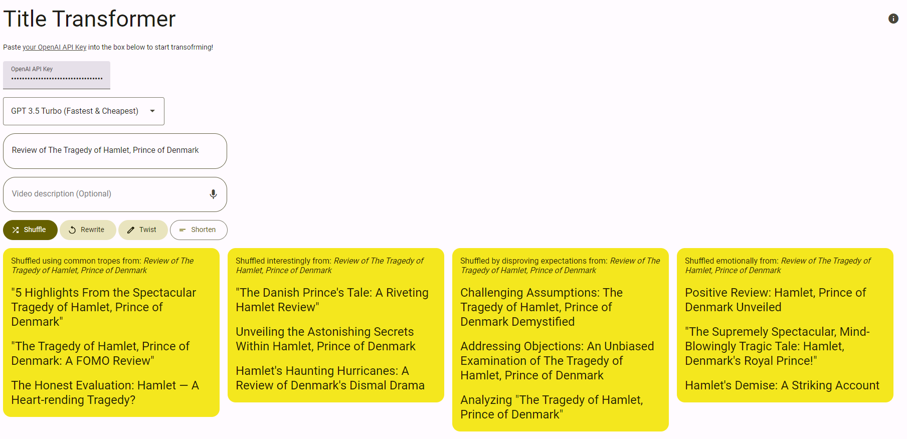

# Title Transformer



Easily transform and create new titles for your YouTube Videos.
Try it out [here](http://thatmacdaddy.me/title-transformer/).

## Setup
    1. Obtain an API key from [OpenAI](https://platform.openai.com/api-keys)
```
It costs roughly $0.01 per 100 titles genereated or so.
```
    2. Paste your API key into the API Key textbox
    3. Input your title into the Title textbox
    4. (Optional) Input your video description into the Description textbox
    5. Click a button to start transforming!

## Transformation Options

- Shuffle
  - Creates 3 titles using common tropes
  - Creates 3 titles using interesting angles
  - Creates 3 expectationn-disproviong titles
  - Creates 3 emotional titles titles
- Rewrite
  - Rephrases the title in 4 different ways
- Twist
  - Rewrites the title 4 different ways using different verbiage
- Shorten
  - Attemps to shorten the current title